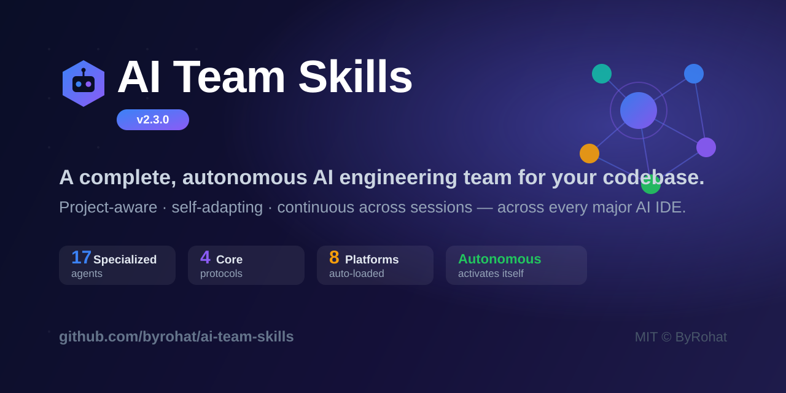

<div align="center">



# 🤖 AI Team Skills

### A complete, autonomous AI engineering team for your codebase — across every major AI IDE.

[](https://github.com/ByRohat/ai-team-skills)
[](LICENSE)
[](#-the-team)
[](#-platform-support)
[](#-contributing)

**17 specialized agents · 4 core protocols · cross-session memory · fully autonomous activation**

[Quick Start](#-quick-start) • [Platforms](#-platform-support) • [The Team](#-the-team) • [How It Works](#-how-it-works) • [Quality Gates](#-quality-gates) • [Brain](#-brain-storage)

</div>

---

## Overview

**AI Team Skills** turns any AI coding assistant into a coordinated, enterprise-grade engineering team. Instead of one generalist model, you get **17 specialized agents** — from Product Owner to SRE — that share a durable memory, enforce quality gates, and adapt to *your* project.

It activates itself. Open your project in a supported IDE and the team reads its brain, understands where the project stands, and gets to work — **you never type "activate."**

> **Why it's different:** most AI assistants forget everything between chats and give generic, textbook advice. AI Team Skills gives the model a persistent **brain** and four **operating protocols** so it behaves like a senior team with perfect long-term memory of your codebase.

---

## ✨ Highlights

- **⚡ Fully Autonomous Activation** — Each IDE auto-loads its native rules file and the team activates on the first message. It then operates on its own, pausing only for costly/irreversible decisions and never bypassing the safety gates.
- **🧠 Smart by Default** — Four cross-cutting protocols (Continuity, Adaptation, Self-Evolution, Clarification) make every agent project-aware, self-adapting, and continuous across sessions.
- **🧬 Project DNA** — `project-profile.json` captures the project's stack, domain, conventions, glossary, and key decisions, so any session instantly understands *what* it's building.
- **🛡️ Quality Gates with Teeth** — Security holds **VETO** power; SRE holds **DEPLOYMENT HOLD** power. Nothing ships until coverage, performance, observability, and docs all pass.
- **🌍 Truly Cross-Platform** — Claude Code, Cursor, Windsurf, Antigravity/Gemini, Trae, OpenAI Codex CLI, GitHub Copilot, and any generic assistant — wired to each tool's real auto-load mechanism.
- **💾 Cross-Session Memory** — Versioned brain files (JSON/TOML) preserve context, decisions, learnings, and an audit trail.
- **🪶 Token-Optimized** — Compact JSON/TOML state and progressive-disclosure skill files keep context usage lean.

---

## 🚀 Quick Start

### One-line install

```bash
# macOS / Linux
curl -sL https://raw.githubusercontent.com/ByRohat/ai-team-skills/main/install.sh | bash
```

```powershell
# Windows PowerShell
irm https://raw.githubusercontent.com/ByRohat/ai-team-skills/main/install.ps1 | iex
```

### Manual install

```bash
git clone https://github.com/ByRohat/ai-team-skills.git
cd ai-team-skills

# Auto-detect your platform, or pass one explicitly
./install.sh /path/to/your/project            # auto-detect
./install.sh /path/to/your/project all        # install for every platform

# Windows
.\install.ps1 C:\path\to\your\project
```

That's it. Open your project in your AI IDE — the team activates itself and greets you with a status report.

---

## 📦 Platform Support

Each platform is wired to the **exact file it auto-loads**, so the team starts with **no manual trigger**.

| Platform | Auto-loaded file(s) | Auto-Start |
|----------|---------------------|:----------:|
| **Claude Code** | `CLAUDE.md` | ✅ |
| **Cursor** | `.cursor/rules/ai-team.mdc` *(alwaysApply)* + `.cursorrules` | ✅ |
| **Windsurf** | `.windsurf/rules/ai-team.md` *(always_on)* + `.windsurfrules` | ✅ |
| **Antigravity / Gemini** | `GEMINI.md` + `AGENTS.md` + `.agents/rules/ai-team.md` | ✅ |
| **Trae IDE** | `.trae/rules/ai-team.md` | ✅ |
| **OpenAI Codex CLI** | `AGENTS.md` | ✅ |
| **GitHub Copilot / VS Code** | `.github/copilot-instructions.md` *(+ `.vscode/` settings)* | ✅ |
| **Generic / Other** | `AI-TEAM.md` | ✅ |

---

## 🧠 How It Works

Every agent runs four cross-cutting **Core Protocols** ([`_core-protocols.md`](.claude/skills/_core-protocols.md)) on top of its domain expertise. Together they make the team behave like one engineer with perfect long-term memory of your project.

| Protocol | Guarantee |
|----------|-----------|
| **🔄 Continuity** | Open a new chat → the model reads the brain (`project-profile` → `project-state` → per-agent) and reconstructs where the project stands *before* acting. No lost context. |
| **🎯 Adaptation** | Every recommendation is tailored to the project's *real* stack, conventions, and glossary — never generic. Empty profile? It detects the stack and populates it. |
| **🌱 Self-Evolution** | The team writes project-specific learnings to the brain and *proposes* skill improvements for your approval — it never edits its own skills silently. |
| **❓ Clarification** | The model asks when a wrong assumption would be costly or hard to reverse (schema, public API, auth, integrations, architecture). For cheap/reversible choices it proceeds and states its assumption. |

And one meta-protocol that ties it together:

> **Protocol 0 — Autonomous Activation:** start on the first message without being asked; operate through the task queue on your own; pause only for the Clarification guardrails; never auto-bypass the Security VETO or SRE DEPLOYMENT HOLD.

---

## 👥 The Team

| Agent | Role | Special Power |
|-------|------|:-------------:|
| **Product Owner** | Backlog grooming, user stories, RICE scoring, OKR alignment | — |
| **Team Lead** | Orchestrates all agents, tracks sprint velocity & risk register | — |
| **Architecture** | System design, event-driven patterns, C4 diagrams, ADR registry | — |
| **UX/UI Designer** | Design systems, tokens, wireframes, WCAG 2.2, design-dev handoff | — |
| **AI Engineer** | LLM integrations, RAG pipelines, multi-agent orchestration, LLMOps | — |
| **Data Engineer** | ETL/ELT, dbt modeling, Kafka streaming, data quality, Airflow | — |
| **Backend** | API development, business logic, DB queries, validation schemas | — |
| **Frontend** | UI components, WCAG 2.2 a11y, Core Web Vitals, i18n | — |
| **Mobile Engineer** | iOS/Android/React Native/Flutter, offline-first, app store | — |
| **DevOps** | Containerization, CI/CD, Kubernetes, secrets management | — |
| **SRE** | SLO/SLI/error budgets, incident mgmt, chaos engineering, capacity | 🟦 **HOLD** |
| **Performance** | Latency budgets, query profiling, k6 load testing, CDN caching | — |
| **Observability** | OpenTelemetry, Prometheus, structured logs, Grafana | — |
| **Security** | OWASP 2024, SAST/DAST, threat modeling | 🟥 **VETO** |
| **Privacy** | GDPR, CCPA, KVKK compliance, DPIA evaluations | — |
| **QA** | Unit/integration/E2E, contract (Pact), mutation (Stryker) tests | — |
| **Docs** | OpenAPI 3.1 specs, runbooks, post-mortems, changelogs | — |

<details>
<summary><b>Agent dependency flow</b></summary>

```
                  ┌──────────────┐
                  │ Product Owner│
                  └──────┬───────┘
                  ┌──────▼───────┐
                  │  Team Lead   │
                  └──────┬───────┘
        ┌────────────────┼───────────────────┐
        ▼                ▼                    ▼
 ┌──────────────┐ ┌──────────────┐   ┌──────────────┐
 │ Architecture │ │    DevOps    │   │     Docs     │
 └──────┬───────┘ └──────┬───────┘   └──────────────┘
        │                ▼
  ┌─────┼──────┐  ┌──────────────┐
  ▼     ▼      ▼  │Observability │
 UX  AI Eng  Data └──────┬───────┘
  │     │      │         │
  ▼     ▼      ▼         │
 Frontend / Backend / Mobile
        │               │
        └──────► QA ◄────┘
                 │
                 ▼
            Performance
                 │
                 ▼
         Security & Privacy
                 │
                 ▼
                SRE
                 │
                 ▼
            DEPLOYMENT
```

</details>

---

## 🚫 Quality Gates

Deployment is **blocked** until every gate passes.

| Gate | Requirement |
|------|-------------|
| 🟥 **Security (VETO)** | 0 open Critical/High vulnerabilities · secret scan clean · CSP/HSTS active |
| 🟦 **Reliability (SRE HOLD)** | SLOs defined · error-budget burn alerts (fast + slow) · runbooks & on-call ready |
| 🟧 **Quality** | Unit ≥ 80% · Integration ≥ 70% · contract tests pass · mutation ≥ 60% |
| 🟨 **Performance** | Lighthouse ≥ 90 · LCP < 2.5s · CLS < 0.1 · INP < 200ms · API p95 < 200ms |
| 🟩 **Observability & DevOps** | OpenTelemetry traces · correlated structured logs · k8s manifests lint-clean |
| 🟦 **Docs & Size** | Runbook + OpenAPI 3.1 complete · no file exceeds 1000 lines |

---

## 💾 Brain Storage

Cross-session memory lives under `.ai-team/brain/`. **Read `project-profile.json` first** — it's the Project DNA.

```
.ai-team/brain/
├── project-profile.json       # 🧬 PROJECT DNA — stack, domain, conventions, glossary, decisions (read FIRST)
├── project-state.json         # status + narrative + open_questions (v2.3.0 schema)
├── task-queue.toml            # backlog with dependencies
├── proposed-improvements.md   # proposed skill changes awaiting approval (Self-Evolution)
├── audit-log.jsonl            # append-only audit trail
└── <agent>-brain.json         # per-agent memory (×17)
```

Every `<agent>-brain.json` carries continuity/evolution fields — `last_session_summary`, `learnings`, `conventions_used`, `open_questions`, `proposed_improvements`. The golden rule: *an action not written to the brain didn't happen as far as the next session is concerned.*

---

## 📝 Slash Commands

| Command | Description |
|---------|-------------|
| `/team-status` | Full team report with all component statuses |
| `/team-blockers` | List active blockers |
| `/team-next` | Fetch the next task from the queue |
| `/deploy-check` | Deployment-readiness verification (runs the gates) |
| `/team-init` | Initialize project configuration |
| `/team-sprint` | Sprint planning & velocity |
| `/team-adr` | Generate an Architecture Decision Record |
| `/team-retro` | Generate a sprint retrospective |
| `/team-risk` | Show the risk register |
| `/team-slo` | SRE SLO dashboard & error budgets |
| `/team-data` | Data Engineer pipeline status |

---

## 📏 File Size Rules

**Maximum 1000 lines per file.**

- **0–700 lines** — normal development
- **700–1000 lines** — ⚠️ prepare to split
- **1000+ lines** — 🚫 split immediately at logical boundaries

---

## 🗂️ Project Structure

```
ai-team-skills/
├── .claude/skills/            # 17 agent skill files + _core-protocols.md (source of truth)
├── .cursor/  .windsurf/       # skill mirrors + native auto-load rules
├── .trae/  .agents/  .github/ # platform-native auto-load rule files
├── CLAUDE.md  AGENTS.md  GEMINI.md  ANTIGRAVITY.md  AI-TEAM.md
├── .cursorrules  .windsurfrules
├── install.sh  install.ps1    # cross-platform installers
├── skill.json                 # canonical manifest (v2.3.0)
├── src/ai-team/
│   ├── brain/                 # brain templates (profile + state + 17 agents)
│   └── scripts/               # brain manager, agent comms, auto-activator (Python)
└── cli/                       # TypeScript CLI (`aiteam`)
```

---

## 🤝 Contributing

Contributions are welcome! A few conventions keep the framework consistent:

- **Source of truth** is `.claude/skills/` — mirror any change to `.cursor/skills/` and `.windsurf/skills/`.
- **Brain templates** live in `src/ai-team/brain/` (the installer copies them).
- **1000-line hard limit** per file (warn at 700).
- **Don't edit skills silently** — propose changes via `.ai-team/brain/proposed-improvements.md`.

Open an issue or PR at [github.com/ByRohat/ai-team-skills](https://github.com/ByRohat/ai-team-skills).

---

## 📄 License

[MIT](LICENSE) © 2026 **ByRohat** — free to use, modify, and distribute.

<div align="center">

**Built with ❤️ for autonomous, full-stack AI development.**

</div>
